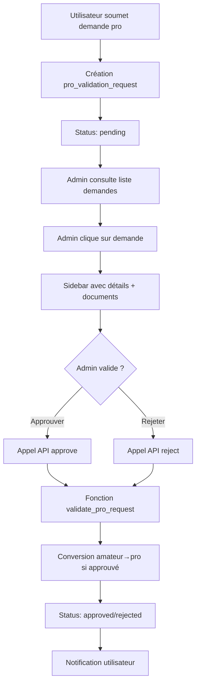

# Guide de Validation des Demandes Professionnelles

Ce guide explique comment utiliser le nouveau système de validation des demandes de conversion en compte professionnel dans Eagle Admin.

## 🎯 Vue d'ensemble

Le système de validation des demandes professionnelles permet aux administrateurs de :
- Visualiser toutes les demandes de conversion amateur → pro
- Examiner les pièces d'identité et informations professionnelles
- Approuver ou rejeter les demandes avec commentaires
- Suivre l'historique des validations

## 🚀 Installation et Mise en Route

### 1. Migration de la Base de Données

Appliquez la migration pour créer les nouvelles tables :

```sql
-- Exécuter le fichier migrations/add_pro_validation_system.sql dans Supabase
-- Ce fichier contient :
-- - Ajout des champs manquants à pro_profiles
-- - Création de la table pro_validation_requests
-- - Fonctions PostgreSQL pour la gestion des validations
-- - Politiques RLS appropriées
```

### 2. Permissions Administrateur

Ajoutez la permission `validate_pro_requests` aux profils admin qui doivent pouvoir valider :

```sql
-- Exemple : donner la permission à un admin
UPDATE admin_profiles 
SET permissions = array_append(permissions, 'validate_pro_requests')
WHERE email = 'admin@example.com';
```

### 3. Vérification de l'Installation

1. Connectez-vous au backoffice Eagle Admin
2. Vérifiez que "Demandes pro" apparaît dans le menu de navigation
3. Accédez à `/pro-requests` - la page devrait s'afficher sans erreur
4. Le dashboard devrait afficher le nombre de demandes en attente

## 📋 Utilisation du Système

### Interface Principale (`/pro-requests`)

**Fonctionnalités :**
- Liste de toutes les demandes avec statuts visuels
- Recherche par nom, email ou SIRET  
- Filtrage par statut (En attente, Approuvées, Rejetées)
- Statistiques en temps réel
- Cartes cliquables pour voir les détails

**Statuts des Demandes :**
- 🟡 **En attente** : Nouvelle demande à traiter
- 🟢 **Approuvée** : Demande validée, utilisateur converti en pro
- 🔴 **Rejetée** : Demande refusée avec motif

### Sidebar de Détail

Cliquez sur une demande pour ouvrir la sidebar avec 3 onglets :

#### 1. Onglet "Informations"
- **Données personnelles** : nom, email, téléphone, ville, âge
- **Informations professionnelles** : SIRET, statut entreprise
- **Historique** : dates de création/validation, admin responsable
- **Notes administratives** : commentaires de validation

#### 2. Onglet "Documents"
- **Visualiseur de pièces d'identité** recto/verso
- **Contrôles de zoom** et téléchargement
- **Mode confidentiel** avec floutage
- **Checklist de vérification** intégrée

#### 3. Onglet "Validation" (si permissions)
- **Checklist de contrôle** pour l'admin
- **Boutons d'action** : Approuver / Rejeter
- **Champ de notes** obligatoire
- **Confirmation** avec modal sécurisée

### Processus de Validation

#### Étapes de Vérification :
1. ✅ **Pièces d'identité** : lisibilité, validité, authenticité
2. ✅ **Cohérence** : nom complet identique
3. ✅ **SIRET** : validation auprès des services officiels si nécessaire
4. ✅ **Statut entreprise** : cohérence avec le SIRET
5. ✅ **Téléphone** : format français correct

#### Actions Disponibles :

**Approuver une Demande :**
- Utilisateur converti automatiquement en "pro"  
- Profil pro créé avec toutes les données
- Statut validation = "approved"
- Notification utilisateur (à implémenter)

**Rejeter une Demande :**
- Utilisateur reste "amateur"
- Motif de rejet enregistré
- Possibilité de nouvelle demande
- Notification utilisateur avec raison (à implémenter)

### Dashboard Intégré

Le dashboard affiche maintenant :
- **Statistique** "Demandes pro en attente" 
- **Alerte** si plus de 5 demandes en attente
- **Liens directs** vers la page de validation

## 🔧 Fonctionnalités Techniques

### API et Endpoints

```typescript
// API de validation
POST /api/pro-requests/[id]/validate
Body: { action: 'approve' | 'reject', admin_notes: string }

// Actions serveur
approveProRequest(requestId: string, notes: string)
rejectProRequest(requestId: string, notes: string)
getProRequests(filters: ProRequestFilters)
getProRequest(requestId: string)
```

### Fonctions PostgreSQL

```sql
-- Créer une nouvelle demande (utilisée par l'app mobile)
SELECT create_pro_validation_request(
  user_id, phone_number, siret, company_status, 
  date_of_birth, id_card_front_url, id_card_back_url
);

-- Valider/rejeter une demande (utilisée par l'admin)
SELECT validate_pro_request(
  request_id, admin_id, 'approve'|'reject', admin_notes
);
```

### Sécurité et Permissions

**Row Level Security (RLS) :**
- Admins : accès complet en lecture/écriture
- Utilisateurs : lecture seule de leurs propres demandes
- Service role : accès total pour les opérations admin

**Permissions Requises :**
- `validate_pro_requests` : pour valider les demandes
- `manage_users` : permission alternative
- `super_admin` : accès automatique à tout

## 🎨 Composants Disponibles

### Composants Réutilisables

```typescript
// Carte de demande avec statut visuel
<ProRequestCard request={request} onClick={handleClick} />

// Visualiseur de documents avec zoom et floutage
<IdentityDocumentsViewer 
  frontUrl={frontUrl} 
  backUrl={backUrl} 
  userName={userName} 
/>

// Actions de validation avec confirmation
<ValidationActions 
  request={request}
  onApprove={handleApprove}
  onReject={handleReject}
/>

// Sidebar complète avec onglets
<ProRequestDetailsSidebar 
  request={selectedRequest}
  isOpen={sidebarOpen}
  onClose={handleClose}
  onApprove={handleApprove}
  onReject={handleReject}
  canValidate={canValidate}
/>
```

### Types TypeScript

```typescript
// Types principaux
type ProRequestStatus = 'pending' | 'approved' | 'rejected';
type ProValidationRequest = Tables<'pro_validation_requests'>;
type ProValidationRequestWithDetails = ProValidationRequest & {
  user_profile: UserProfile;
  admin_profile?: AdminProfile;
};

// Types de filtres
interface ProRequestFilters {
  status: ProRequestStatus | 'all';
  dateRange?: DateRange;
  search?: string;
}
```

## 📊 Workflow Complet



## 🚨 Points d'Attention

### Sécurité
- **Confidentialité** : Les pièces d'identité sont floutées par défaut
- **Permissions** : Vérifiez les droits admin avant validation
- **Audit Trail** : Toutes les actions sont tracées avec l'admin responsable

### Performance  
- **Images** : Les pièces d'identité peuvent être lourdes, optimisez le chargement
- **Pagination** : Implémentez la pagination si le volume augmente
- **Cache** : Les statistiques dashboard sont calculées à chaque chargement

### UX/UI
- **Responsiveness** : Interface adaptée mobile/desktop
- **Feedback** : Messages de succès/erreur explicites  
- **Navigation** : Breadcrumbs et liens contextuels

## 🔄 Évolutions Futures

### Améliorations Prévues
- [ ] **Notifications push** pour nouvelles demandes
- [ ] **Validation SIRET** automatique via API officielle
- [ ] **Reconnaissance OCR** pour extraction automatique des données
- [ ] **Historique détaillé** des actions admin
- [ ] **Exports** PDF des validations
- [ ] **Statistiques avancées** et reporting

### API Externe
- [ ] **Webhook** pour notifier l'app mobile
- [ ] **Endpoints publics** pour suivi de demande
- [ ] **API SIRET** pour validation automatique

---

## 📞 Support

Pour toute question sur l'utilisation ou problème technique :

1. **Vérifiez** que la migration a été appliquée
2. **Contrôlez** les permissions de l'utilisateur admin  
3. **Consultez** les logs navigateur (F12) pour erreurs
4. **Testez** avec un utilisateur `super_admin`

Le système est maintenant opérationnel et prêt à gérer les demandes de validation professionnelle ! 🚀